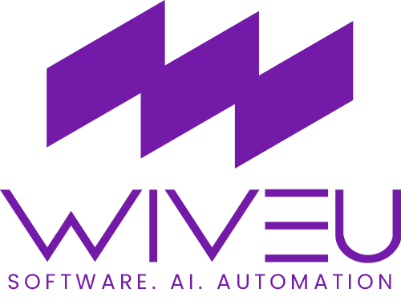

<p align="center">
  
</p>

<h1 align="center">PRD — Claude Code Skill</h1>

<p align="center">
  A Claude Code skill that creates production-grade Product Requirements Documents through structured, interview-driven conversations.
</p>

<p align="center">
  Also compatible with <strong>Cursor</strong>, <strong>Windsurf</strong>, and other AI coding agents that support custom instructions or rules.
</p>

<p align="center">
  <a href="https://wiveu.com">wiveu.com</a>
</p>

---

## What It Does

`prd` guides you through a structured discovery interview and produces a complete, developer-ready PRD — without you needing to know anything about PRD structure. Claude asks targeted questions, synthesizes your answers, and builds the document iteratively.

Works for **mobile apps**, **web apps**, **SaaS products**, **APIs**, and **internal tools**.

## Compatible Agents

This skill works with any AI coding agent that supports custom instructions or skill/rules files:

| Agent | How to Use |
|---|---|
| **Claude Code** | Native skill — loaded automatically via `SKILL.md` |
| **Cursor** | Add `SKILL.md` content to `.cursor/rules` |
| **Windsurf** | Add `SKILL.md` content to `.windsurfrules` |
| **Other agents** | Paste `SKILL.md` into your agent's system prompt or rules file |

## How to Trigger It

Invoke the skill by saying things like:

- "Create a PRD for my app"
- "Help me spec out [product idea]"
- "Write a product requirements document for [feature]"
- "Document the requirements for [project]"
- "I need a technical spec for [idea]"

## Workflow

```
1. Kickoff          →  Understand platform, scope, and timeline pressure
2. Discovery        →  Targeted interview across up to 12 topic areas
3. Synthesis        →  Draft sections as answers accumulate
4. Review           →  Present draft, gather feedback, refine
5. Finalize         →  Deliver a complete Markdown PRD file
```

The interview is **adaptive** — sections are skipped or expanded based on what you're building.

## Interview Areas

| Area | What Gets Extracted |
|---|---|
| Problem & Users | Problem statement, personas, competitive landscape |
| Value Proposition | Differentiator, core mechanic, "aha moment" |
| Feature Set | Must-haves, explicit out-of-scope, feature gating |
| User Flows | Onboarding, core loop, error states |
| Platform & Architecture | Tech stack, sync strategy, offline behavior |
| Data Model | Entities, relationships, data ownership |
| Monetization | Business model, pricing, paywall placement |
| Design & UX | References, platform conventions, accessibility |
| Success Metrics | North star metric, KPIs, launch goals |
| Risks & Mitigations | Technical, assumption, and external risks |
| Timeline & Milestones | Phases, deliverables, hard deadlines |
| Open Questions | Unresolved decisions, explicit TBDs |

## Output

A structured Markdown file named `[ProductName]_PRD_v[Version].md`, including:

- Metadata table (version, date, author, status, platforms)
- Executive Summary with problem statement and target user
- Platform & technical requirements
- Prioritized feature list
- Step-by-step user flows
- Data model with entities and relationships
- Design guidelines
- Monetization strategy
- KPIs with targets and timeframes
- Risk register with mitigations
- Phased development milestones
- Open questions log

## Adaptive Modes

| Mode | Behavior |
|---|---|
| **Simple / MVP** | Skips monetization, condenses architecture into brief notes |
| **Complex / Enterprise** | Expands data model, adds security, compliance, and integration sections |
| **Feature Spec** | Skips problem statement, focuses on flow changes, data delta, and rollout |

## Repository Structure

```
prd-skill/
├── SKILL.md                     # Skill definition (works with Claude Code, Cursor, Windsurf, etc.)
├── references/
│   ├── prd-template.md          # Output template for the final PRD
│   └── question-bank.md         # Detailed question library by section
└── images/
    ├── logo.png
    └── claude.jpeg
```

## Philosophy

> A good PRD is not a wish list — it's a decision log. Every section answers a specific question that will come up during development.

The goal is to surface ambiguity **before** development starts, not mid-sprint.

---

<p align="center">
  Made by <a href="https://wiveu.com">Wiveu</a>
</p>
